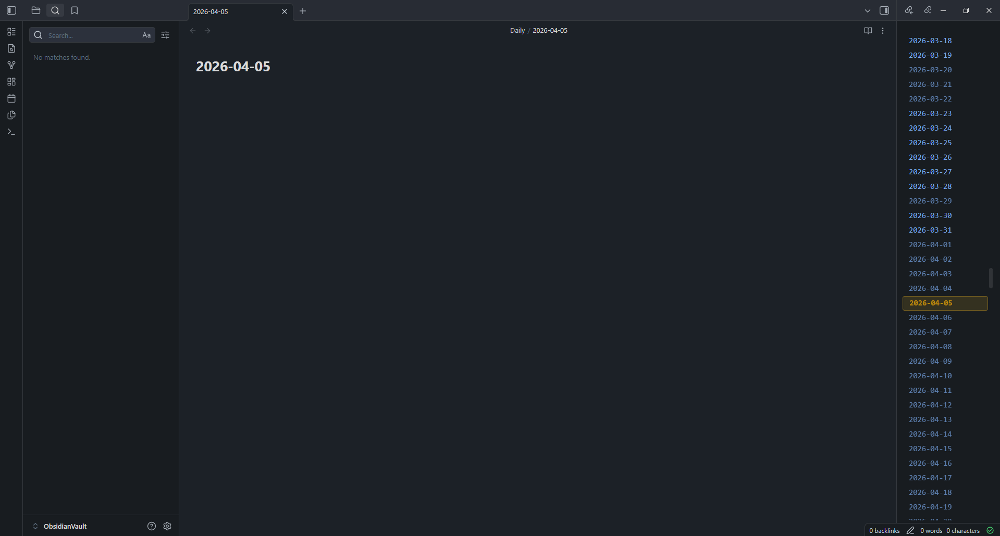

# Daily Note Ber

An [Obsidian](https://obsidian.md/) plugin that adds a scrollable date panel for quick navigation to daily notes.

## Features

- **Infinite Scroll Date Panel**: Browse through dates with smooth infinite scrolling in both directions
- **Visual Indicators**: 
  - Existing daily notes are highlighted as clickable links
  - Non-existing dates appear as unresolved links
  - Today's date is highlighted with a golden accent
- **Quick Navigation**: "Go to Today" button appears when you scroll away from the current date
- **Auto-Create Notes**: Click any date to open its daily note (creates it if it doesn't exist)
- **Respects Your Settings**: Uses your configured daily note format from the core Daily Notes plugin

## Installation

1. Clone this repository into your vault's `.obsidian/plugins/` directory
2. Run `npm install` to install dependencies
3. Run `npm run build` to compile the plugin
4. Reload Obsidian and enable the plugin in Settings > Community Plugins

## Usage

After enabling the plugin, use the **Show date panel** command to open the date panel in the sidebar.

### Commands

- **Open today's daily note**: Quickly open or create today's daily note
- **Show date panel**: Reveal the date panel if it's hidden

You can assign hotkeys to these commands in Settings > Hotkeys.

## Requirements

This plugin requires the core **Daily Notes** plugin to be enabled in Obsidian.

## License

[BSD Zero Clause License](LICENSE)
